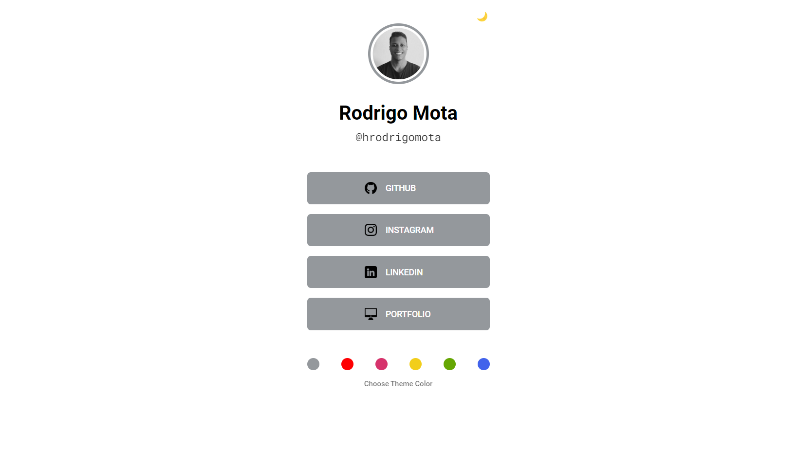

# Contact Link

  

## 📑 Description

Contact Link is a tool based on the final project of Rocketseat's Marathon Explorer 2.0. However, in this case, JavaScript methods were inserted to provide more interactivity of colors and themes for project users.

## 🔗 Functions

This tool can be used to share personal or professional contacts, such as social media, phone number, email, address and others.

## 💻 Language and Tools

For the development of this project, the following languages and tools were used:

- [HTML](https://developer.mozilla.org/pt-BR/docs/Web/HTML)
- [CSS](https://developer.mozilla.org/pt-BR/docs/Web/CSS)
- [JavaScript](https://developer.mozilla.org/pt-BR/docs/Web/JavaScript)

## 🚀 Deploy

Click on the link below to access the project 👇🏾

- [Contact Link](https://hrodrigomota.github.io/contact-link/)
